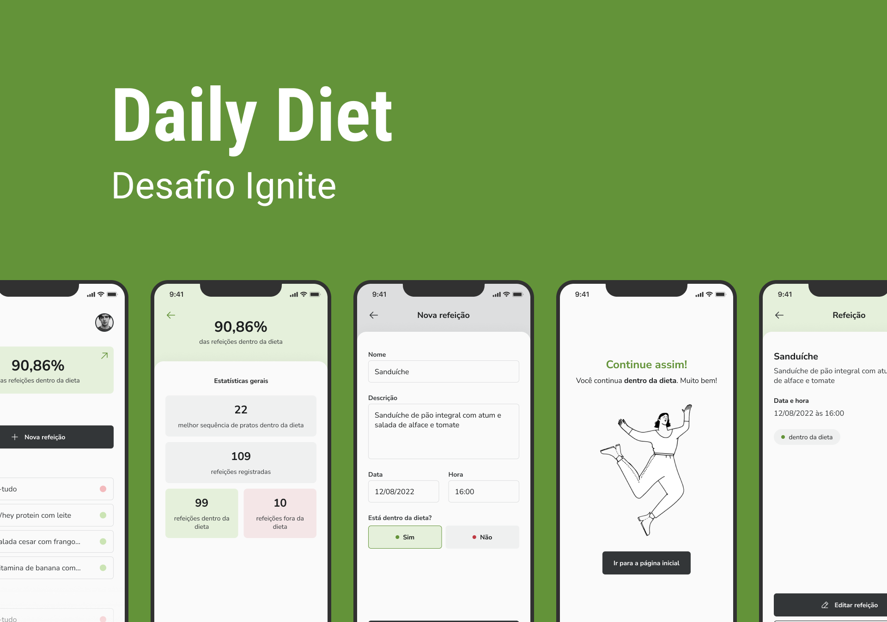

<h1>
  
</h1>

## 💻 Projeto

<h3>
  Projeto criado para resolução do desafio da nova trilha de React Native de 2022 criado por Rocketseat. Uma aplicação para registro de alimentação diário. É possível fazer acompanhamento com porcentagem de qualidade das refeições que são registradas dentro da dieta.
</h3>

---

## 🎨 Layout

O layout da aplicação está disponível no Figma:

----

## ✨ Tecnologia

- **[TypeScript](https://www.typescriptlang.org/)**
- **[React Native](https://reactnative.dev/)**
- **[Expo](https://expo.dev/)**
- **[Styled-Components](https://styled-components.com/)**
- **[React Native - Async Storage](https://reactnative.dev/docs/asyncstorage)**
- **[React Navigation](https://reactnavigation.org/)**
- **[React Native Community DatetimePicker ](https://github.com/react-native-datetimepicker/datetimepicker)**

---

## 🚀 Como executar o projeto

**Para que esse projeto funcione corretamente, é preciso estar com o servidor rodando.**

- Instale as dependências com `npm install`.
- Execute `npx expo start` para iniciar o servidor do Expo.

---

## ⚙️ Funcionalidades

- [x] Deve ser possível registrar alimentação com as informações de nome, descrição, data e hora e o status se está dentro da dieta ou não;
- [x] Dever ser possível visualizar a refeição e editar ou excluir;
- [x] Calculo básico de porcentagem para mostrar dados da dieta;
